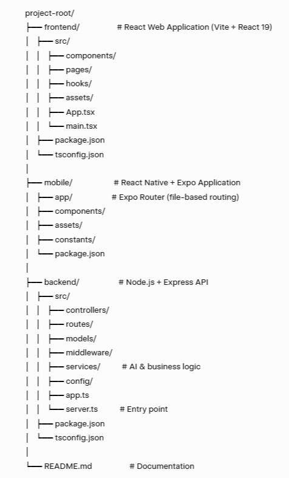

# AI Study Hub (Practicum)

AI-powered study tool that helps students learn faster by generating summaries, flashcards, and quizzes from their study materials.

## 📂 Repository Links

- **Frontend Repo**: /frontend
- **Mobile Repo**: /mobile
- **Backend Repo**: /backend

## 🧠 Problem Statement

Students often struggle to process large amounts of information and create effective study materials like summaries and flashcards.  
This project automates these tasks using AI, allowing students to focus on learning rather than organization.

The application is designed for students and lifelong learners facing information overload and time-consuming manual study prep.  
It provides immediate, high-quality study aids tailored to the user's specific content.

## 🎯 Features

- AI Summarization: Automatically generate concise summaries from long study materials.
- Flashcard Generation: Create study decks instantly using AI.
- Interactive Quizzes: Test knowledge with AI-generated questions.
- Study Dashboard: Track progress and manage study resources.
- Multi-platform: Access via web or mobile (React Native).
- Secure Auth: JWT-based authentication for user accounts.

## 🛠 Tech Stack

### Frontend & Mobile

- **React 19** (Web) & **React Native / Expo** (Mobile)
- **TypeScript**
- **Tailwind CSS v4** & **NativeWind v4**
- **Vite** & **Expo Router** (file-based routing, very similar to Next.js)
- **Lucide React** (Icons)
- **Context API** — global state management (auth & user data)
- **SecureStore** (Expo) — secure encrypted storage for auth tokens (analog of localStorage)
- **Native fetch** + custom API wrapper — lightweight API calls (no external libraries like Axios)

### Backend

- **Node.js & Express.js**
- **TypeScript**
- **Google Generative AI** (Gemini API)
- **REST API**

### Database

- **MongoDB** (Mongoose)

### Tooling

- **Git & GitHub**
- **GitHub Actions** (CI)
- **dotenv** (Environment variables)
- **ESLint / Prettier**

## 📁 Project Structure
Here's a visual overview of the repository:

*(Click to enlarge if needed)*
## ⚙️ Setup & Installation

### Prerequisites

- Node.js (v18+ recommended)
- npm (Package Manager)
- MongoDB (Local or Atlas)
- Gemini API Key (for AI features)

### Backend Setup

1. Navigate to the backend directory:
   cd backend
   text2. Install dependencies:
   npm install
   text3. Create a `.env` file based on existing config:
   PORT=5000
   MONGO_URI=your_mongodb_connection_string
   GEMINI_API_KEY=your_gemini_api_key
   JWT_SECRET=your_secret_key
   NODE_ENV=development
   text4. Start the development server:
   npm run dev
   text### Frontend Setup

1. Navigate to the frontend directory:
   cd frontend
   text2. Install dependencies:
   npm install
   text3. Start the development server:
   npm run dev
   textThe app usually runs on: http://localhost:5173

### Mobile Setup

1. Navigate to the mobile directory:
   cd mobile
   text2. Install dependencies:
   npm install
   text3. Start the Expo development server:
   npx expo start
   text- Press **a** → run on Android emulator/device
- Press **i** → run on iOS simulator (Mac only)
- Scan QR code with **Expo Go** app on real phone

Tunnel mode (for testing on physical device over internet):
npx expo start --tunnel
text## 🧪 Available Scripts

### Backend

- `npm run dev` — Starts the server with nodemon and tsc watch
- `npm run build` — Compiles TypeScript to JavaScript
- `npm start` — Runs the compiled server from dist/

### Frontend

- `npm run dev` — Starts Vite development server
- `npm run build` — Builds the app for production
- `npm run lint` — Runs ESLint for code quality
- `npm run preview` — Previews the production build locally

### Mobile

- `npx expo start` — Standard Expo start
- `npx expo start --tunnel` — Expo start with tunnel (useful for testing on physical devices)
- `npm run android` — Run on Android
- `npm run ios` — Run on iOS

## 🔐 API Overview

### Endpoints

- **Auth**: `POST /api/auth/register`, `POST /api/auth/login`
- **Resources**: `GET /api/resources`, `POST /api/resources`, `POST /api/resources/:id/summary`
- **Flashcards**: `POST /api/flashcard-sets/generate`, `GET /api/flashcard-sets`, `GET /api/flashcard-sets/:setId`
- **Quiz**: `POST /api/quiz-sets/generate`, `GET /api/quiz-sets`, `POST /api/quiz-sets/:quizId/submit`
- **AI Assistant**: `POST /api/ai/chat`

## 🤝 Team & Collaboration

### Team Members

- Aida Burlutckaia — Full-Stack Developer
- Alena Danilchenko — Frontend Developer
- Anastasia Nikulkina — Mobile Developer
- Dmytro Azarenkov — Backend Developer
- Kseniia Zakharova — Backend Developer
- Natalia Sirtak — Full-Stack Developer

## 📌 Known Issues / Limitations

- No automated tests yet.

## 📄 License

This project is for educational purposes only.
